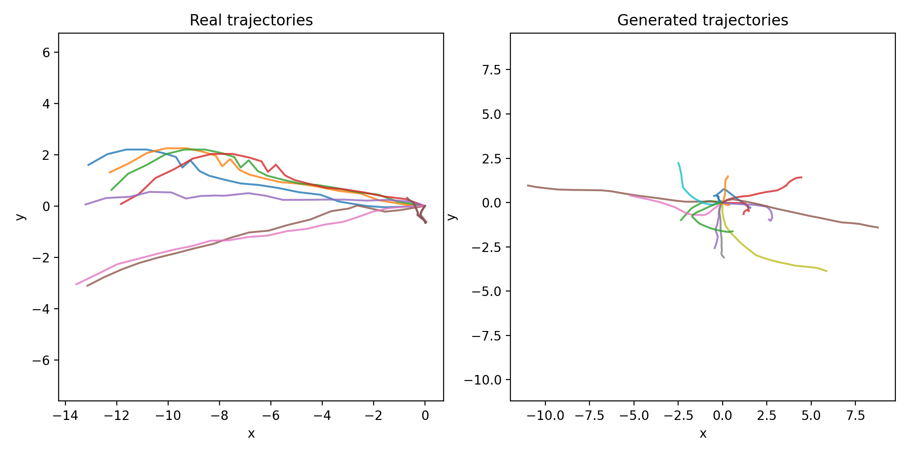
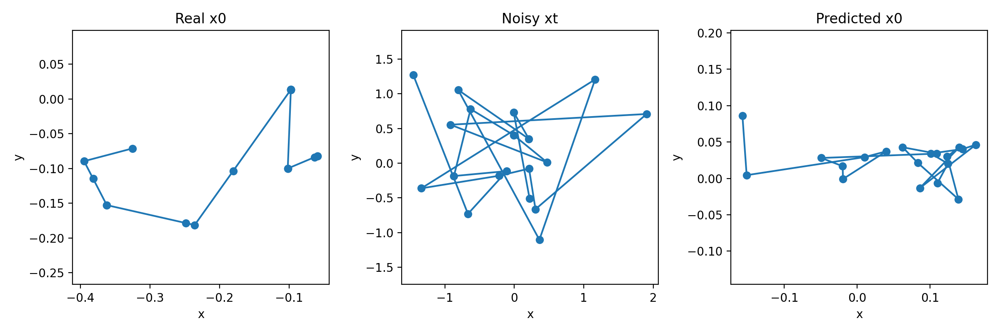
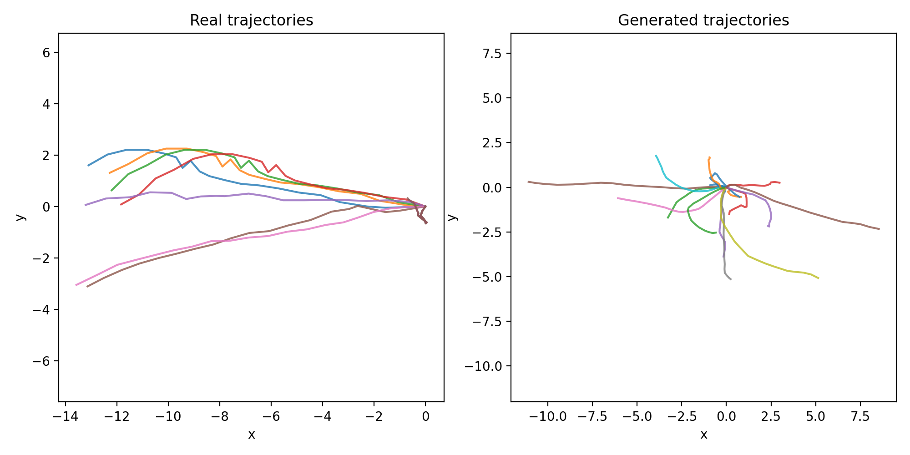
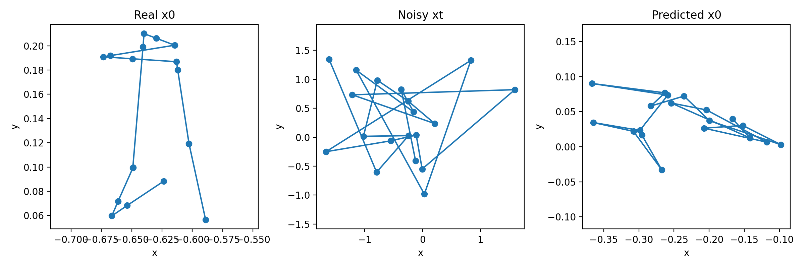
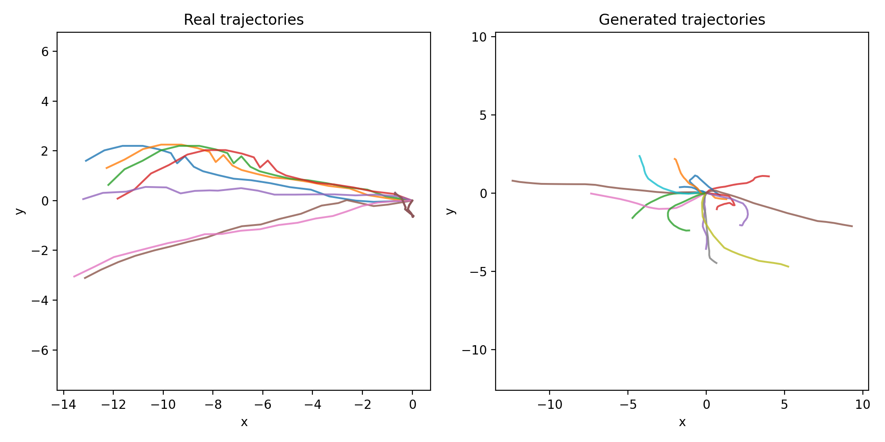
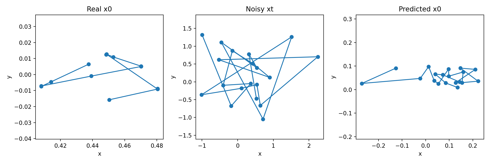
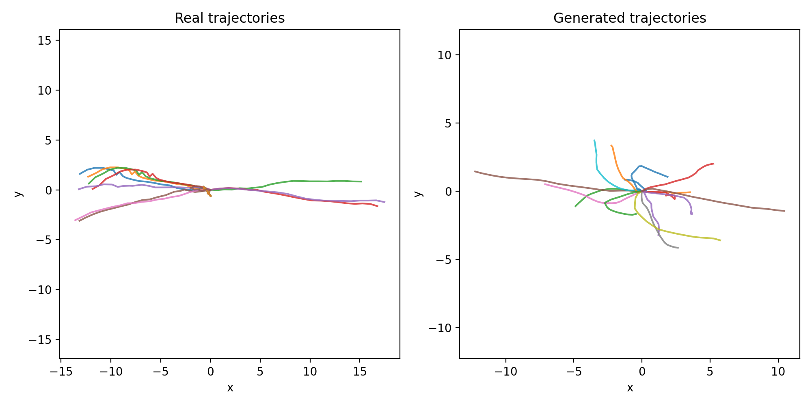
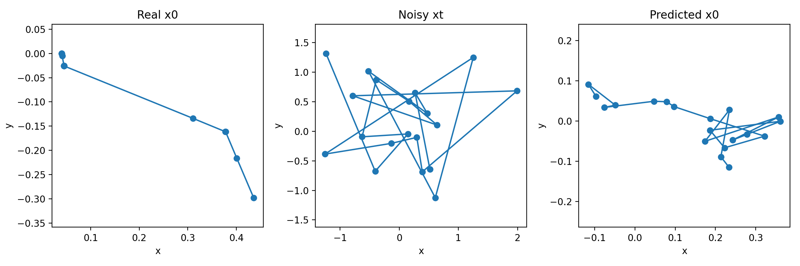
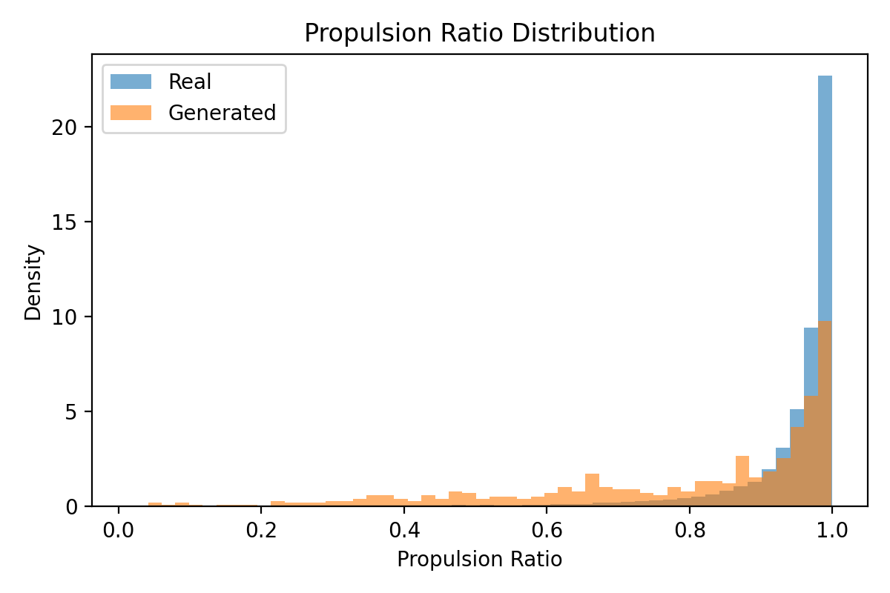
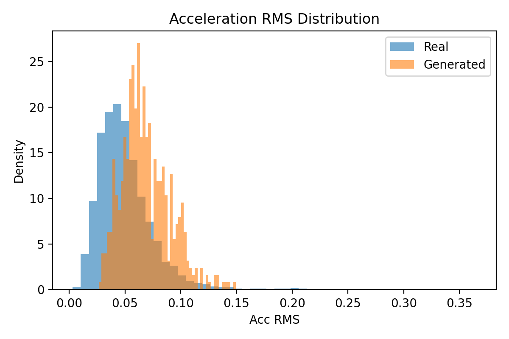

# Stage 2: Pre-training the Domain Knowledge Diffusion Model

This repository section documents the trajectory-only diffusion prior used in Stage 2 of the project. The goal of this stage is to learn a reusable pedestrian motion prior from public ETH+UCY trajectory data, fully decoupled from any downstream sensor setup.

## Experimental Protocol

We conduct a filtering-threshold ablation on the ETH+UCY motion prior. The four variants differ only in the low-speed filtering threshold:

- `none`: no threshold filtering
- `q10`: 10th percentile threshold over positive step norms
- `q20`: 20th percentile threshold over positive step norms
- `q30`: 30th percentile threshold over positive step norms

All four variants share the same:

- dataset family: ETH+UCY
- model: DDPM prior with `hidden_dim=128`
- batch size: `128`
- diffusion timesteps: `100`
- train/val split: fixed and identical across runs
- random seed: fixed and identical across runs
- maximum epochs: `50`
- checkpoint selection: best validation checkpoint
- sample count: `512`
- evaluation metrics: `step_norm_all`, `avg_speed`, `total_length`, `endpoint_displacement`, `moving_ratio_global`, `propulsion_ratio`, `acc_rms`

The only controlled factor is the filtering threshold.

## What We Keep Private

This repository intentionally does not include raw pedestrian trajectory files or the full processed training corpus. Only derived figures, summaries, and code required to reproduce the Stage 2 pipeline are tracked here.

That means:

- no raw trajectory data is committed
- no large training outputs are exposed as source data
- only selected, publication-oriented figures are included

## Qualitative Figures

The following figures summarize the sampling behavior for each filtering variant.

### `none`

Real versus generated trajectories:

Single-step denoising check:

### `q10`

Real versus generated trajectories:

Single-step denoising check:

### `q20`

Real versus generated trajectories:

Single-step denoising check:

### `q30`

Real versus generated trajectories:

Single-step denoising check:

## Distribution-Level Diagnosis

The Stage 2 evaluation uses a fixed seven-metric suite to compare generated and real trajectories. For the representative `q20` setting, we additionally keep the following diagnostic plots:

These plots are intended to support the manuscript discussion of trajectory shrinkage, effective progression, and local smoothness.

## Interpretation

The four-variant ablation is designed to test one hypothesis only: whether a stronger low-speed filter improves the learned motion prior without changing the rest of the training recipe. In manuscript language, the variants can be described as a controlled threshold sweep over the same trajectory-only diffusion backbone.

The current evidence suggests:

- `none` preserves the broadest raw distribution but may retain more low-motion content
- `q10` and `q30` shift the data distribution toward stronger motion intensity
- `q20` is the most balanced operating point in the current pipeline

## Reproducibility

The corresponding scripts are:

- `tools/prior/train/train_ddpm_eth_ucy_h128.py`
- `tools/prior/sample/reverse_sample_ddpm_eth_ucy_h128.py`
- `tools/prior/eval/analyze_generated_vs_real_eth_ucy_h128.py`

Each script accepts a `--variant` argument, so the entire ablation can be reproduced by changing only the threshold variant.
