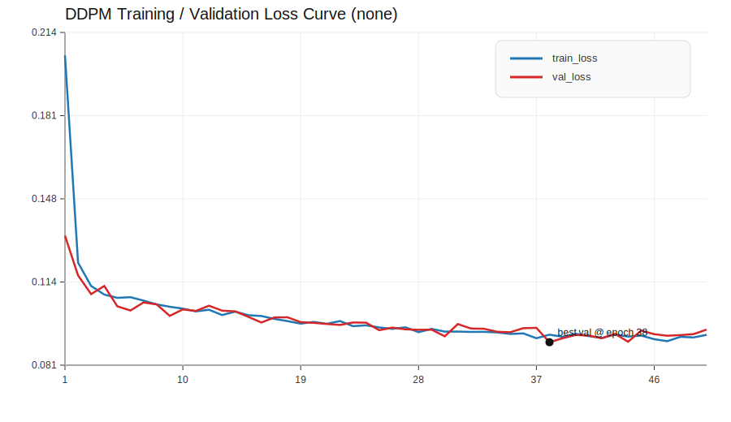
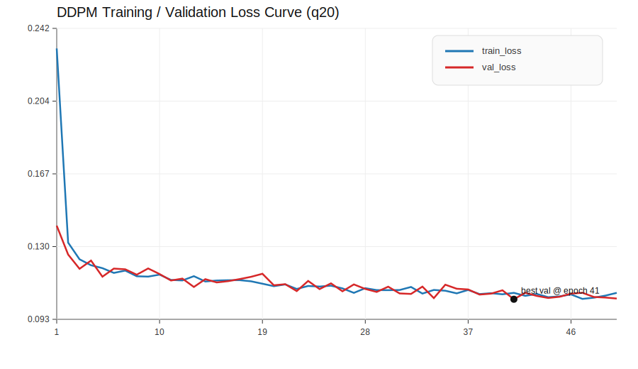

# Stage 2: Pre-training the Domain Knowledge Diffusion Model

Stage 2 is the trajectory-only diffusion pre-training stage of the thesis. Its purpose is to learn a reusable pedestrian motion prior from public ETH+UCY trajectory data, fully decoupled from any downstream sensor setup.

Stage 2 should be treated as a registry-driven trajectory prior pipeline. The official registry, narrative, and path resolution live in [`utils/prior/ablation_paths.py`](../utils/prior/ablation_paths.py). That file is the single source of truth for Stage 2 variant semantics, official train/eval records, narrative labels, and output locations.

## Reading Order

If you are reading this page for the first time, follow this order:

1. `Official Stage 2 Interpretation`
2. `Privacy and Repository Safety`
3. `Qualitative Reverse Sampling`
4. `Key Diagnostic Figures`
5. `Interpretation`
6. `Reproducibility`

This order mirrors the logic of the Stage 2 experiments:

- first define the goal
- then fix the protocol
- then state the registry semantics
- then compare the four filtering variants
- then inspect the figures
- finally reproduce the pipeline from the scripts

## Official Stage 2 Interpretation

Use this section as the authoritative summary of the Stage 2 result.

The registry exposes two semantic entry points:

- `optimization_best -> none`
- `motion_balanced -> q20`

The official reading of the filtering-threshold ablation is intentionally not a single global winner:

- `none` = optimization-best baseline under the unified protocol
- `q20` = most balanced motion-focused prior among filtered variants
- `q10` = weak-filter reference point
- `q30` = strong-filter reference point

The four variants share the same unified Stage 2 protocol:

- dataset family: ETH+UCY
- model: h128 DDPM prior
- batch size: `128`
- diffusion timesteps: `100`
- random seed: `42`
- maximum epochs: `50`
- checkpoint selection: best validation checkpoint
- sample count: `512`
- evaluation metrics: `step_norm_all`, `avg_speed`, `total_length`, `endpoint_displacement`, `moving_ratio_global`, `propulsion_ratio`, `acc_rms`

Scripts may accept either raw variants (`none/q10/q20/q30`) or semantic names (`optimization_best/motion_balanced`), depending on the entry point implementation.

All paths, checkpoints, `sample_dir`, `eval_dir`, official train/eval records, and narrative labels are resolved through [`utils/prior/ablation_paths.py`](../utils/prior/ablation_paths.py).

## Privacy and Repository Safety

This public repository includes code, selected figures, and lightweight docs only.

- No raw pedestrian trajectory files are committed.
- No processed training corpora are committed.
- No checkpoints or large training outputs are committed.
- Only selected publication-oriented figures are kept in `docs/`.

## Official Seeded Reference Runs

The public Stage 2 figures are produced as seeded reference runs so that the published visuals can be reproduced exactly.

- Reverse sampling is stochastic, so exact public figures require fixed seeds and fixed selection rules.
- The official reference protocol uses `sample_seed=42`, `vis_seed=42`, `num_generate=512`, `num_show=16`, `denoise_selection=endpoint_quantile`, and `denoise_quantile=0.5`.
- Public reference runs write a lightweight `manifest.json` next to the PNG figures so the exact inputs and resolved indices are traceable.
- This reproducibility workflow does not change the official Stage 2 protocol, the registry semantics, the model, the sampling math, or the evaluation metrics.

The figures in this page are linked from the seeded public assets under `docs/assets/stage2/<variant>/reference_seed42/`.

If you need to reproduce the public figures from scratch, use the registry-driven public scripts in the repository root README. The public workflow is designed so that code and lightweight manifests are enough for reproduction; raw trajectory corpora, checkpoints, and large outputs are intentionally not part of the public repository.

The manifest files that accompany the public figures are:

- `docs/assets/stage2/none/reference_seed42/sample/manifest.json`
- `docs/assets/stage2/none/reference_seed42/eval/manifest.json`
- `docs/assets/stage2/q20/reference_seed42/sample/manifest.json`
- `docs/assets/stage2/q20/reference_seed42/eval/manifest.json`

These manifests show the resolved registry entry, fixed seeds, selected indices, and the exact public asset layout for the seeded reference runs.

## Qualitative Reverse Sampling

The following figures are qualitative only. They help compare the reverse-sampling behavior of the four official variants, but they do not by themselves establish a global ranking.

These figures are best read as a visual sanity check for the trajectory generator. They show how the learned prior behaves under different filtering strengths, but they do not replace the distribution-level diagnostics.

### `none`

Real versus generated trajectories:

Single-step denoising check:

### `q10`

Real versus generated trajectories:

Single-step denoising check:

### `q20`

Real versus generated trajectories:

Single-step denoising check:

### `q30`

Real versus generated trajectories:

Single-step denoising check:

## Key Diagnostic Figures

These figures provide distribution-level support for the Stage 2 discussion. They should be read as diagnostics rather than absolute claims of superiority.

They are especially useful for understanding why `none` is the optimization-best baseline and why `q20` is the most balanced motion-focused prior among filtered variants.

### `none`

Endpoint displacement distribution:

Propulsion ratio distribution:

### `q20`

Endpoint displacement distribution:

Propulsion ratio distribution:

Acceleration RMS distribution:

### Loss Curve

The following curves are compact training diagnostics for the official `none` and `q20` 50-epoch reference runs. They are included as auxiliary training diagnostics, not as standalone proofs of overall superiority.

`none` loss curve:

`q20` loss curve:

## Interpretation

The filtering-threshold ablation is a controlled sweep over a single factor: the low-speed filtering threshold. All other settings are fixed by the unified Stage 2 protocol.

The official Stage 2 conclusion should be read as:

- `none` provides the optimization-best baseline under the unified protocol.
- `q20` provides the most balanced motion-focused prior among filtered variants.
- `q10` is the weak-filter reference point.
- `q30` is the strong-filter reference point.

The role of the diagnostic figures is to support the official interpretation with distribution-level evidence, especially for endpoint progression, propulsion, and local motion smoothness.

## Reproducibility

The Stage 2 pipeline is reproduced via the following scripts:

- `tools/prior/train/train_ddpm_eth_ucy_h128.py`
- `tools/prior/sample/reverse_sample_ddpm_eth_ucy_h128.py`
- `tools/prior/eval/analyze_generated_vs_real_eth_ucy_h128.py`
- `tools/prior/export_reference_figures.py`

These scripts may accept either raw variant names or semantic registry names, depending on the entry point implementation. For example:

- `optimization_best` resolves to `none`
- `motion_balanced` resolves to `q20`

When in doubt, treat [`utils/prior/ablation_paths.py`](../utils/prior/ablation_paths.py) as the authoritative reference for the active protocol, naming, and output layout.

For the seeded public figure workflow, use fixed seeds and keep the exported assets lightweight:

- PNG figures
- `manifest.json`
- no `.npy` files
- no checkpoints
- no large training outputs

## Figure Guidance

Keep the root README lightweight and use this page for detailed figure grids and interpretation.

Recommended for README:

- a single link to this Stage 2 page

Recommended to keep only here:

- all four reverse-sampling figure pairs
- diagnostic figures for `none` and `q20`
- any optional loss-curve comparisons
