# Stage 2: Trajectory Prior Learning

Stage 2 learns a reusable pedestrian motion prior from public ETH+UCY trajectory data, fully decoupled from any downstream sensor setup. The scientific question remains the same: can a diffusion prior trained only on motion recover realistic geometry, smoothness, and progression without collapsing the data manifold?

The registry, narrative history, and path resolution still live in [`utils/prior/ablation_paths.py`](../utils/prior/ablation_paths.py). That file remains the canonical source of variant names and historical protocol records. However, the **current interpretation layer** of the repository is now the completed multi-seed `15`-seed, `100`-epoch result.

## Reading Order

If you are reading Stage 2 now, follow this order:

1. `Current Mainline Interpretation`
2. `Legacy Reference Layers`
3. `Repository Layout`
4. `Qualitative Reverse Sampling`
5. `Key Diagnostic Figures`
6. `Interpretation Boundary`
7. `Reproducibility`

This order mirrors the logic of the Stage 2 experiments:

- define the objective
- fix the protocol
- state the registry semantics
- compare the four variants
- inspect the evidence
- reproduce the pipeline from the scripts

## Current Mainline Interpretation

The current mainline Stage 2 reading is the **completed 15-seed, multi-seed `100`-epoch screening result** documented in [`docs/stage2_phaseA_multiseed_100epoch_report.md`](stage2_phaseA_multiseed_100epoch_report.md).

At the current stage, the strongest repository-supported conclusions are:

- `none` is the **multi-seed training-objective best** under the fixed `100`-epoch screening protocol.
- `q10` is the **closest secondary candidate** under the same protocol and should be carried together with `none` into the next longer-training stage.
- `q20` and `q30` remain informative references for filtered priors, but they are not the main current candidates under the multi-seed `100`-epoch evidence.

This means the repository should currently be read as supporting a **two-candidate shortlist** rather than a single global winner.

## Legacy Reference Layers

The original Stage 2 single-seed `50`-epoch interpretation is retained only as a historical reference layer.

That layer recorded:

- `optimization_best -> none`
- `motion_balanced -> q20`

and corresponded to the following fixed protocol:

- dataset family: ETH+UCY
- model: h128 DDPM prior
- batch size: `128`
- diffusion timesteps: `100`
- random seed: `42`
- maximum epochs: `50`
- checkpoint selection: best validation checkpoint
- sample count: `512`
- evaluation metrics: `step_norm_all`, `avg_speed`, `total_length`, `endpoint_displacement`, `moving_ratio_global`, `propulsion_ratio`, `acc_rms`

This legacy reading should still be kept for traceability and historical comparison, but it is **not** the main result layer anymore once the multi-seed `100`-epoch evidence is available.

The archived Phase A sweep is also part of the current mainline record:

- seed set: `2`, `3`, `4`, `12`, `13`, `14`, `22`, `23`, `24`, `32`, `33`, `34`, `42`, `43`, `44`
- epochs: `100`
- variants: `none`, `q10`, `q20`, `q30`

This sweep is the current mainline evidence, not a side note, and should be treated as the default reading for Stage 2.

## Repository Layout

The preferred browsing order for the current Stage 2 archive is:

- [`outputs/prior/train/`](../outputs/prior/train) for the seed-resolved training archive
- [`outputs/prior/sample/`](../outputs/prior/sample) for reverse-sampling outputs
- [`outputs/prior/eval/`](../outputs/prior/eval) for distribution-level diagnostics
- [`docs/stage2_phaseA_multiseed_100epoch_report.md`](stage2_phaseA_multiseed_100epoch_report.md) for the current mainline screening result

The earlier follow-up note for `seed43` and `seed44` is no longer needed as a separate interpretation layer. Those runs are already subsumed into the multi-seed archive and should not carry standalone narrative weight.

## Privacy and Repository Safety

This public repository includes code, selected figures, and lightweight docs only.

- No raw pedestrian trajectory files are committed.
- No processed training corpora are committed.
- No checkpoints or large training outputs are committed.
- Only selected publication-oriented figures are kept in `docs/`.

## Official Seeded Reference Runs

The public Stage 2 figures are produced as seeded reference runs so that the published visuals can be reproduced exactly.

- Reverse sampling is stochastic, so exact public figures require fixed seeds and fixed selection rules.
- The official reference protocol uses `sample_seed=42`, `vis_seed=42`, `num_generate=512`, `num_show=16`, `denoise_selection=endpoint_quantile`, and `denoise_quantile=0.5`.
- Public reference runs write a lightweight `manifest.json` next to the PNG figures so the exact inputs and resolved indices are traceable.
These fixed seeded reference figures support reproducibility, but they do not by themselves define the current Stage 2 conclusion.

## Qualitative Reverse Sampling

The following figures are qualitative only. They help compare reverse-sampling behavior across the four official variants, but they do not by themselves establish the current mainline shortlist.

### `none`

Real versus generated trajectories:

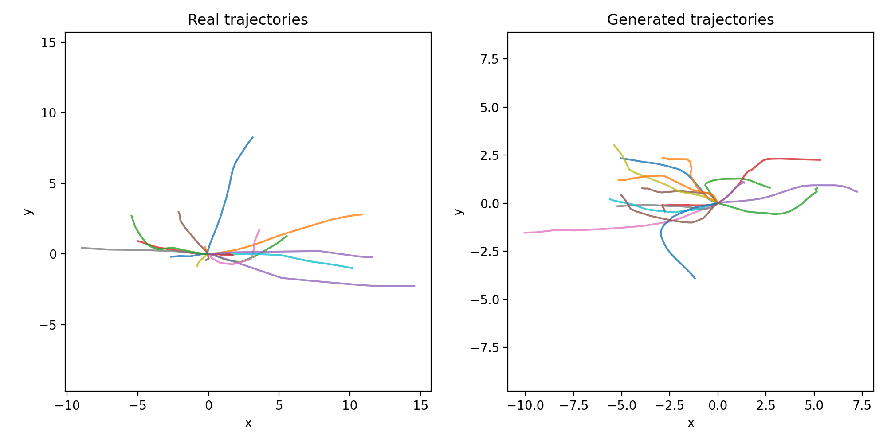

Single-step denoising check:

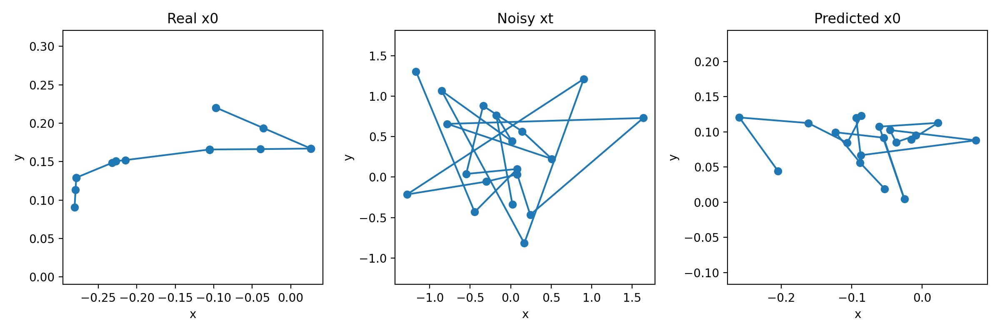

### `q10`

Real versus generated trajectories:

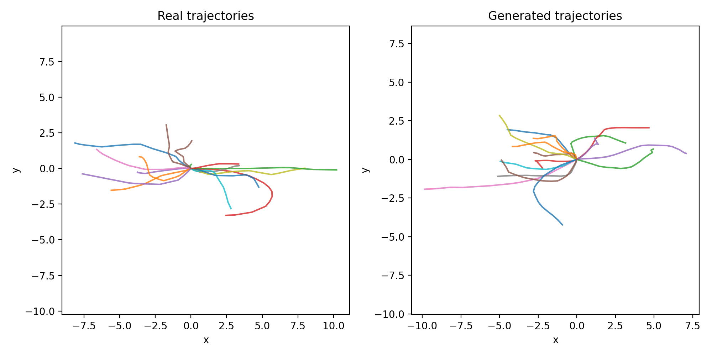

Single-step denoising check:

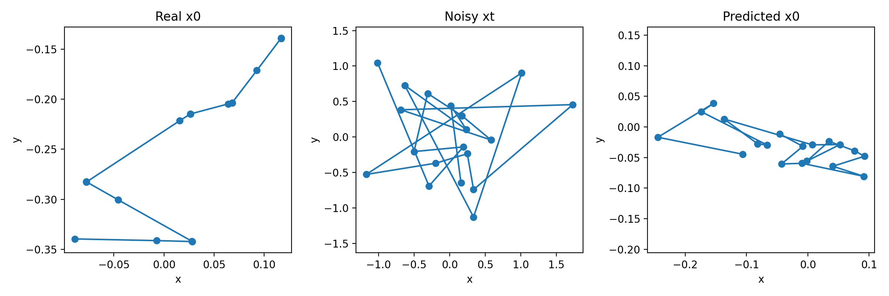

### `q20`

Real versus generated trajectories:

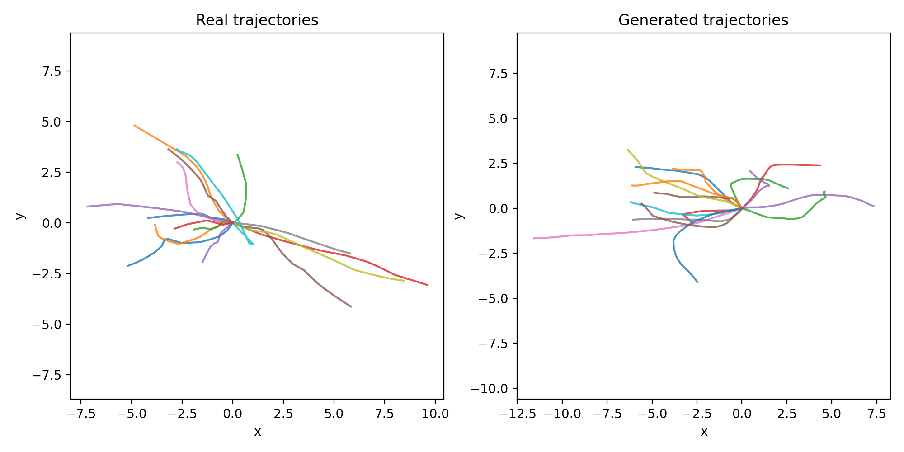

Single-step denoising check:

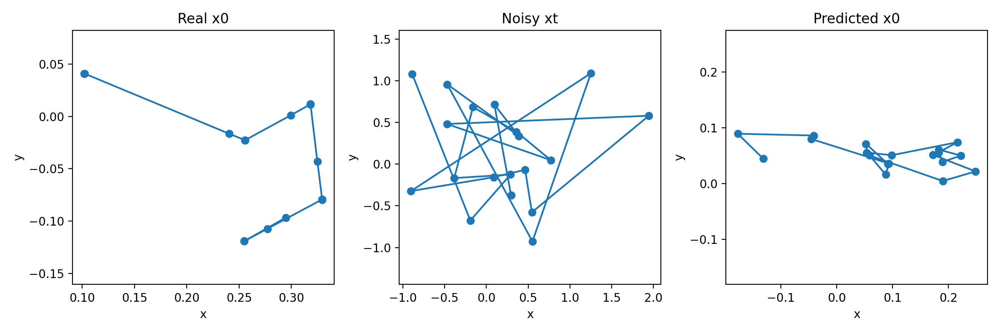

### `q30`

Real versus generated trajectories:

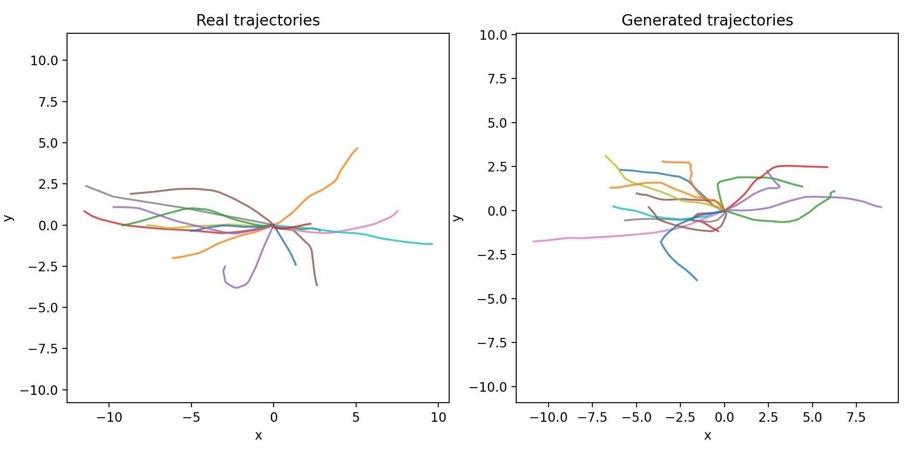

Single-step denoising check:

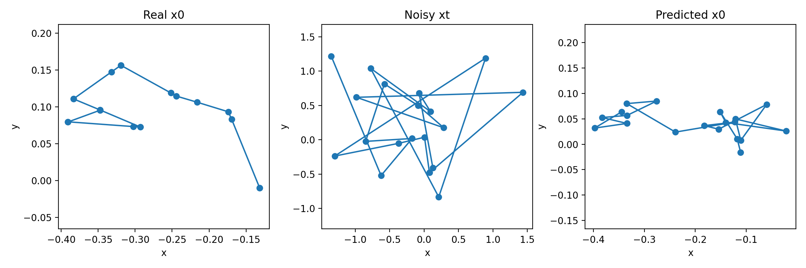

## Key Diagnostic Figures

These figures provide distribution-level support for Stage 2 diagnostics. They should be read as evidence of geometry, progression, and smoothness mismatch, not as standalone declarations of a final winner.

### `none`

Endpoint displacement distribution:

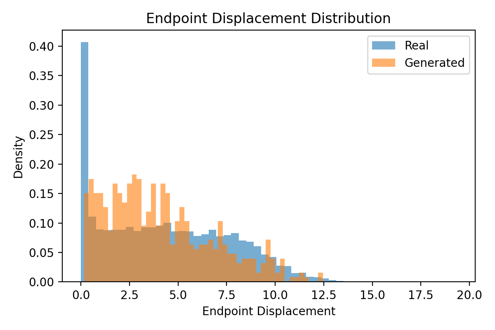

Propulsion ratio distribution:

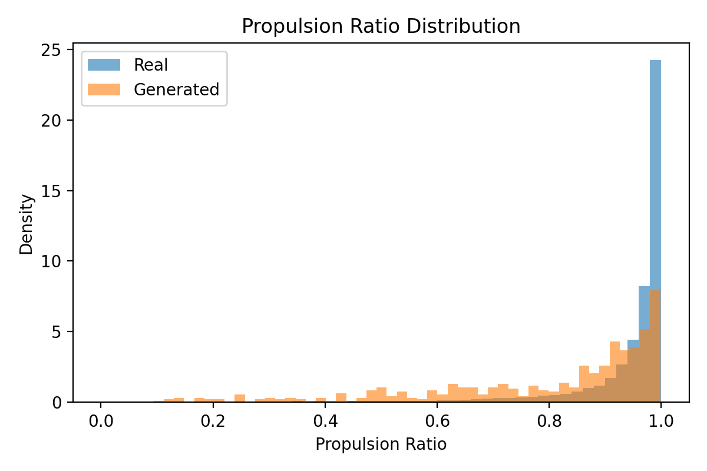

### `q20`

Endpoint displacement distribution:

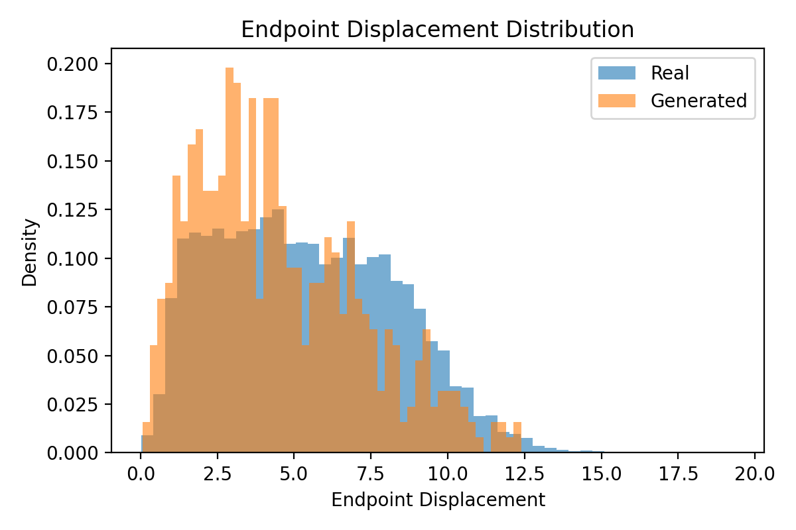

Propulsion ratio distribution:

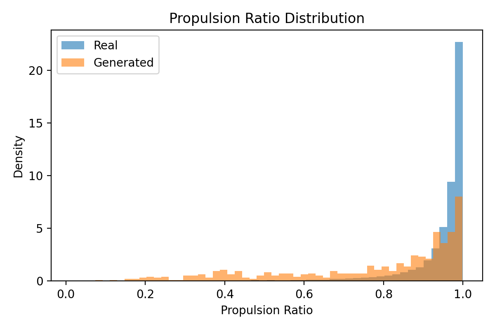

Acceleration RMS distribution:

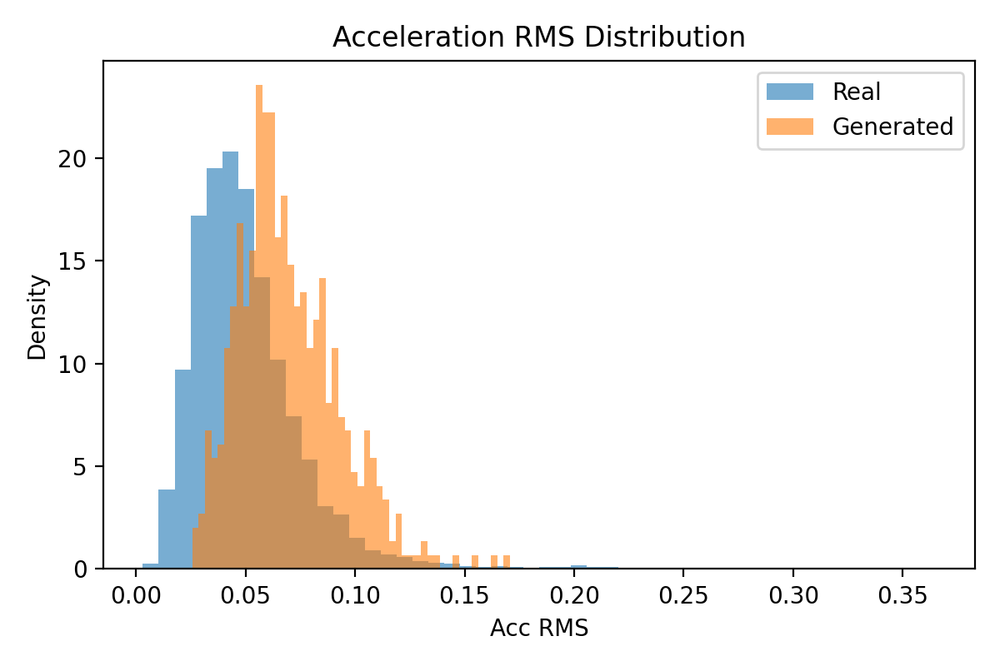

### Loss Curves

The following curves are compact training diagnostics.

`none` loss curve: 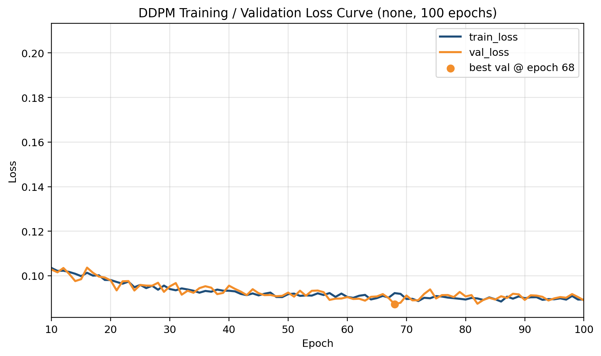
`q10` loss curve: 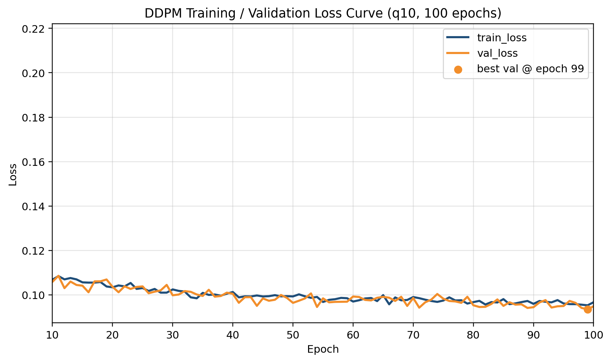
`q20` loss curve: 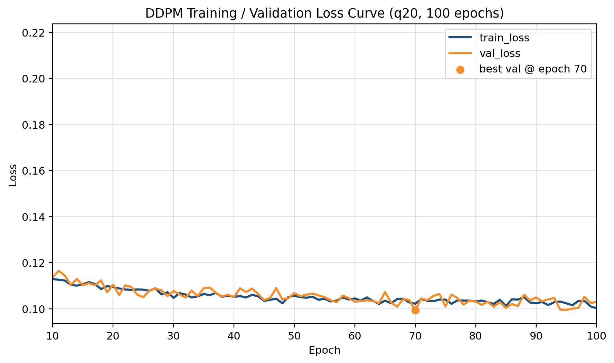
`q30` loss curve: 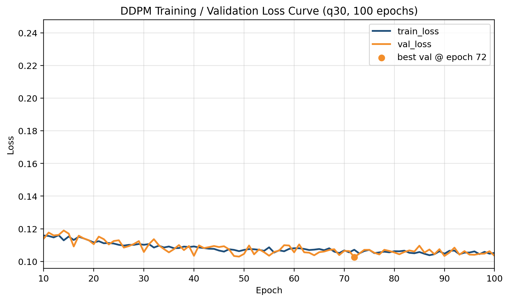

## Interpretation Boundary

The current repository-supported reading should be stated conservatively:

- the original `50`-epoch single-seed conclusion is still available as a legacy reference;
- the current mainline evidence comes from the completed 15-seed multi-seed `100`-epoch screening result;
- the present outcome is a **shortlist** (`none` plus a secondary candidate, currently `q10`), not a final application-level winner;
- the next stage should therefore focus on longer training and stronger comparison only for the shortlisted candidates.

## Reproducibility

The Stage 2 pipeline is reproduced via the following scripts:

- `tools/prior/train/train_ddpm_eth_ucy_h128.py`
- `tools/prior/sample/reverse_sample_ddpm_eth_ucy_h128.py`
- `tools/prior/eval/analyze_generated_vs_real_eth_ucy_h128.py`
- `tools/prior/export_reference_figures.py`

When in doubt, treat [`utils/prior/ablation_paths.py`](../utils/prior/ablation_paths.py) as the historical registry source, and treat [`docs/stage2_phaseA_multiseed_100epoch_report.md`](stage2_phaseA_multiseed_100epoch_report.md) as the current mainline interpretation page.
