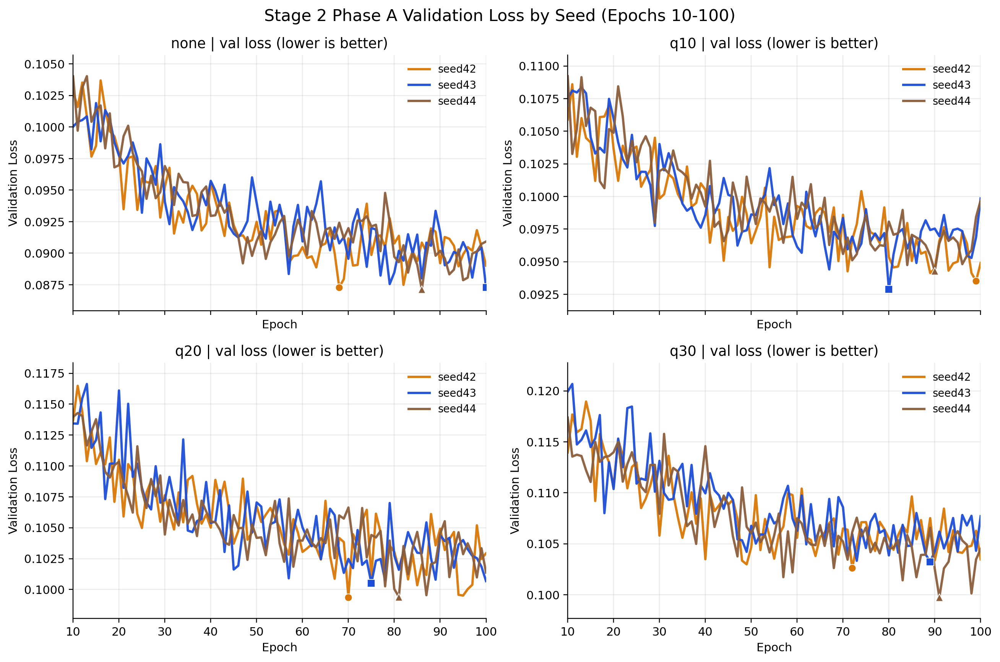
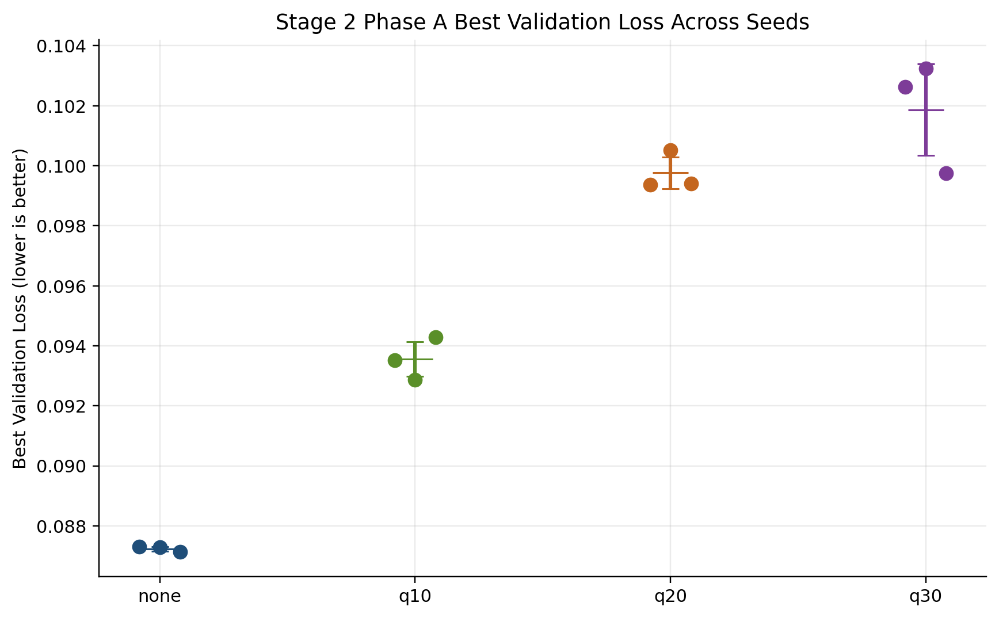
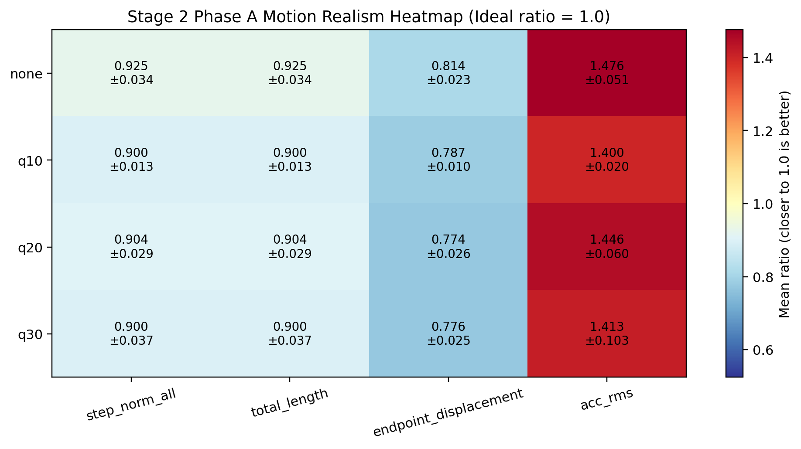
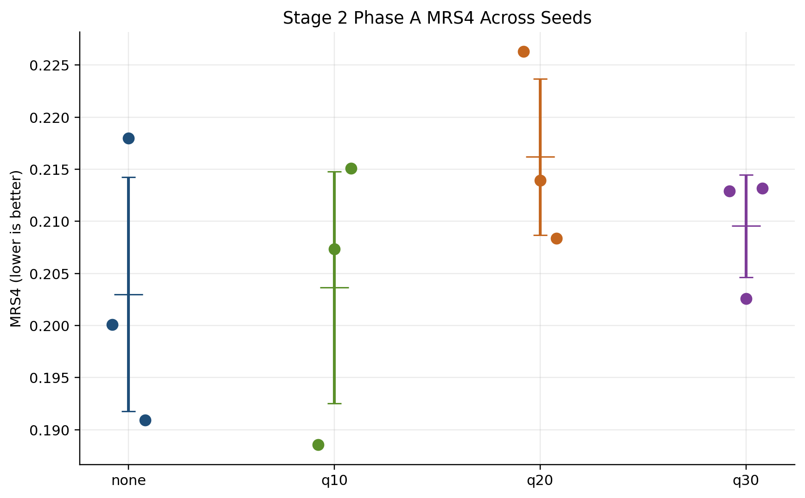
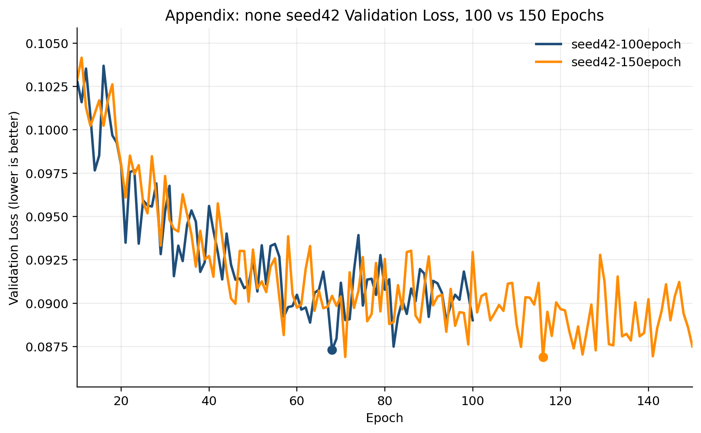

# Stage 2 Multi-seed 100-epoch Screening Result

## Objective

This report is the current mainline result page for Stage 2.

It consolidates the four official variants under a fixed `100`-epoch budget across train seeds:

- `42`
- `43`
- `44`

The goal of this report is not to declare the final application-best prior, but to identify which variants should survive into the next longer-training stage.

Validation loss is treated as a training diagnostic rather than a complete decision rule. The report therefore compares both:

- an optimization view
- a motion realism view

## Protocol

- dataset: ETH+UCY processed relative trajectories
- representation: `19 x 2` relative-step trajectory windows
- variants: `none`, `q10`, `q20`, `q30`
- train seeds: `42`, `43`, `44`
- epochs: `100`
- checkpoint used for eval: `best_model.pt`
- sample seed fixed to: `42`
- visualization seed fixed to: `42`
- reverse sample count per run: `512`
- qualitative figure count per run: `16`

## Optimization View

| variant | mean_best_val_loss | std_best_val_loss | mean_best_epoch | std_best_epoch |
| --- | --- | --- | --- | --- |
| none | 0.0872 | 0.0001 | 84.6667 | 13.0979 |
| q10 | 0.0936 | 0.0006 | 89.6667 | 7.7603 |
| q20 | 0.0998 | 0.0005 | 75.3333 | 4.4969 |
| q30 | 0.1019 | 0.0015 | 84.0000 | 8.5245 |

## Motion Realism View

| variant | mean_step_norm_all_ratio | mean_total_length_ratio | mean_endpoint_displacement_ratio | mean_acc_rms_ratio | mean_mrs4 |
| --- | --- | --- | --- | --- | --- |
| none | 0.9251 | 0.9251 | 0.8135 | 1.4757 | 0.2030 |
| q10 | 0.8996 | 0.8996 | 0.7866 | 1.4004 | 0.2037 |
| q20 | 0.9037 | 0.9037 | 0.7740 | 1.4461 | 0.2162 |
| q30 | 0.8996 | 0.8996 | 0.7760 | 1.4134 | 0.2096 |

## Interim Answers

### Is 100 epochs still obviously insufficient?

Not obviously. The appendix comparison for `none/seed42` shows additional improvement from 100 to 150 epochs, but the 100-epoch runs have already entered a relatively stable validation-loss regime rather than remaining in the steep early-descent phase.

### How different are validation loss and motion realism rankings?

They are not identical. The optimization view orders variants by mean best validation loss as `none, q10, q20, q30`, while the motion-realism view orders them by mean MRS4 as `none, q10, q30, q20`.

### Which two variants should move to the next stage?

The two variants that should move forward are `none` and `q10`: one to preserve the strongest optimization-side baseline and one to preserve the strongest motion-realism candidate.

## Recommended Finalists

- optimization-best candidate: `none`
- application-best candidate: `none`

These labels are deliberately conservative. The optimization-best candidate is selected from the lowest mean best validation loss, while the application-best candidate is selected from the lowest mean MRS4. The two views are related but not identical, and they should not be collapsed into a single global winner without the downstream stage.

## Appendix Figure

