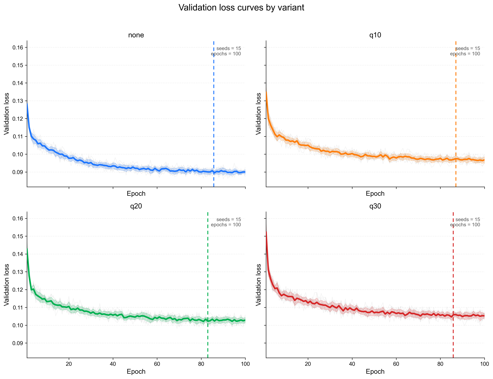
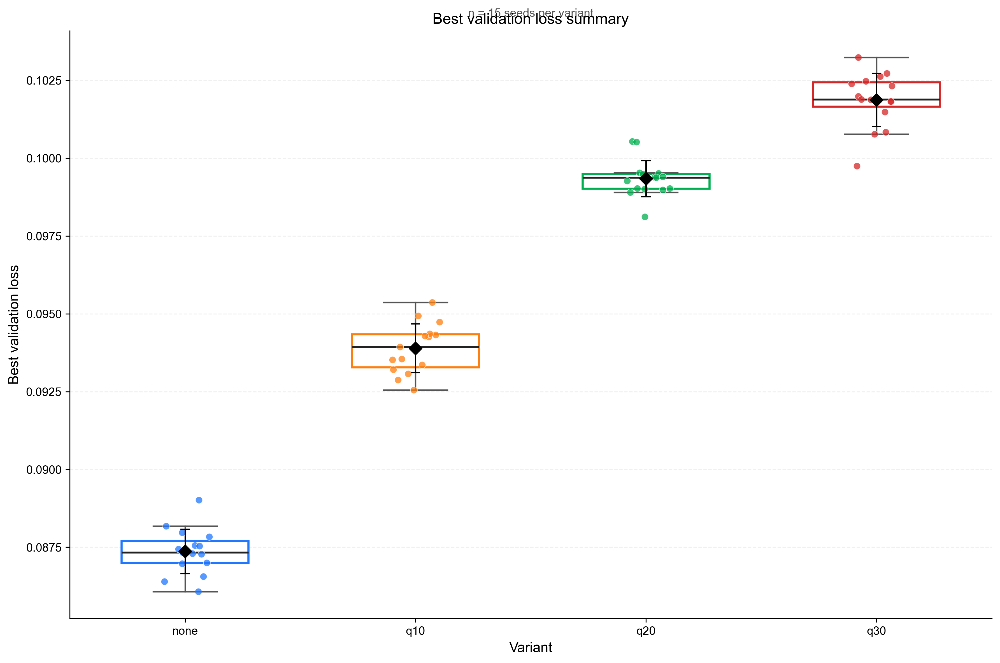
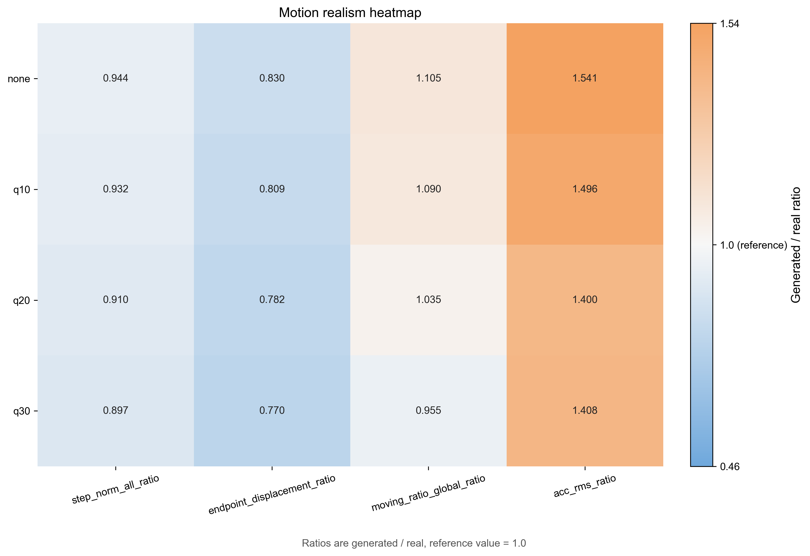
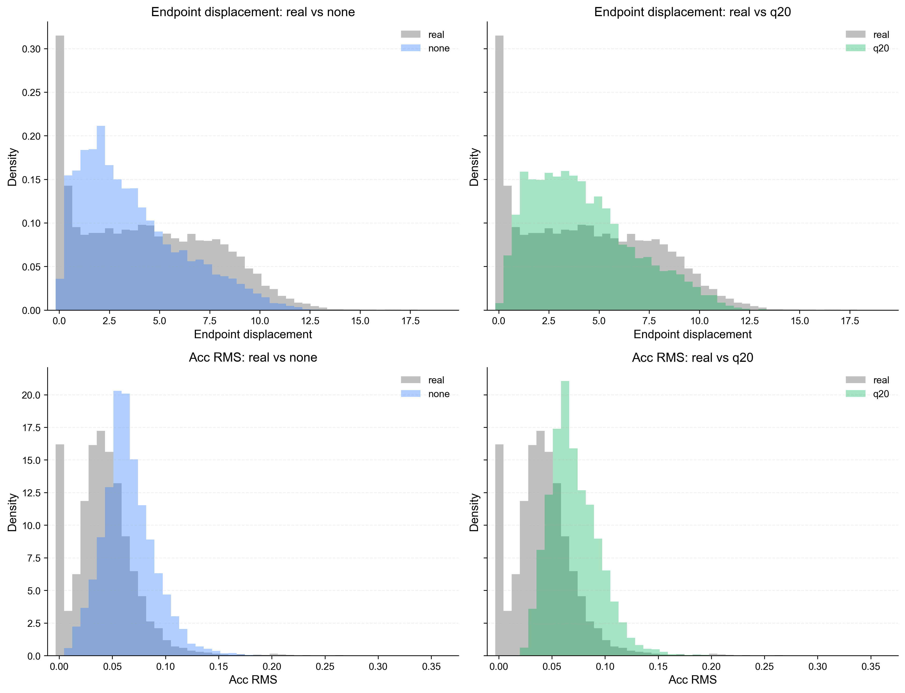

# Stage 2 Multi-seed 100-epoch Screening Result

## Objective

This report summarizes the current Stage 2 screening results for the four official variants under a shared `100`-epoch budget and a completed `15`-seed sweep.

The report is intended to document the experimental evidence, not to provide presentation-style commentary. Validation loss is treated as an optimization diagnostic, and motion ratios are treated as a distribution-level behavior check under the same evaluation protocol.

## Protocol

- dataset: ETH+UCY processed relative trajectories
- representation: `19 x 2` relative-step trajectory windows
- variants: `none`, `q10`, `q20`, `q30`
- train seeds: `2`, `3`, `4`, `12`, `13`, `14`, `22`, `23`, `24`, `32`, `33`, `34`, `42`, `43`, `44`
- epochs: `100`
- checkpoint used for eval: `best_model.pt`
- sample seed fixed to: `42`
- visualization seed fixed to: `42`
- reverse sample count per run: `512`
- qualitative figure count per run: `16`

## Optimization View

| variant | mean_best_val_loss | std_best_val_loss | min_best_val_loss | max_best_val_loss | mean_best_epoch | std_best_epoch |
| --- | --- | --- | --- | --- | --- | --- |
| none | 0.0874 | 0.0007 | 0.0861 | 0.0890 | 85.6667 | 9.2568 |
| q10 | 0.0939 | 0.0008 | 0.0925 | 0.0954 | 87.0000 | 9.5289 |
| q20 | 0.0993 | 0.0006 | 0.0981 | 0.1005 | 82.9333 | 10.4529 |
| q30 | 0.1019 | 0.0009 | 0.0997 | 0.1032 | 85.8000 | 9.7789 |

## Motion Realism View

| variant | step_norm_all_ratio | endpoint_displacement_ratio | moving_ratio_global_ratio | acc_rms_ratio |
| --- | --- | --- | --- | --- |
| none | 0.9442 | 0.8304 | 1.1050 | 1.5411 |
| q10 | 0.9320 | 0.8092 | 1.0896 | 1.4960 |
| q20 | 0.9100 | 0.7823 | 1.0350 | 1.4002 |
| q30 | 0.8968 | 0.7701 | 0.9546 | 1.4084 |

## Brief Summary

- In the optimization view, the ordering by mean best validation loss is `none`, `q10`, `q20`, `q30`.
- In the retained motion-ratio view, the four variants remain distinguishable and do not collapse to the same distribution-level profile.
- This page keeps the result summary short and does not include the earlier `none/seed42` `100`-vs-`150` appendix comparison.
